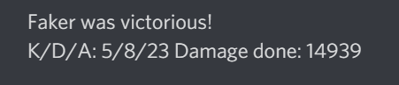

# League of legends discord bot
The league of legends discord bot will post match results in a designated chat room on a discord server, after a match is completed. It will monitor only the users that are specified in list of users. 

## How to add users
1. Go to src/users.ts
2. Add a User object to the users array
  1. Repeat this step for all users you want to add

## Environment variables
These are the environment variables you need to provide in order for the bot to work:
- DISCORD_BOT_TOKEN, token for your discord bot
- DISCORD_CHANNEL_NAME, name of the channel that the bot should post in
- RIOT_API_TOKEN, api token for requesting information from the riot api

## Screenshot
Here is a screenshot from the discord chat:
